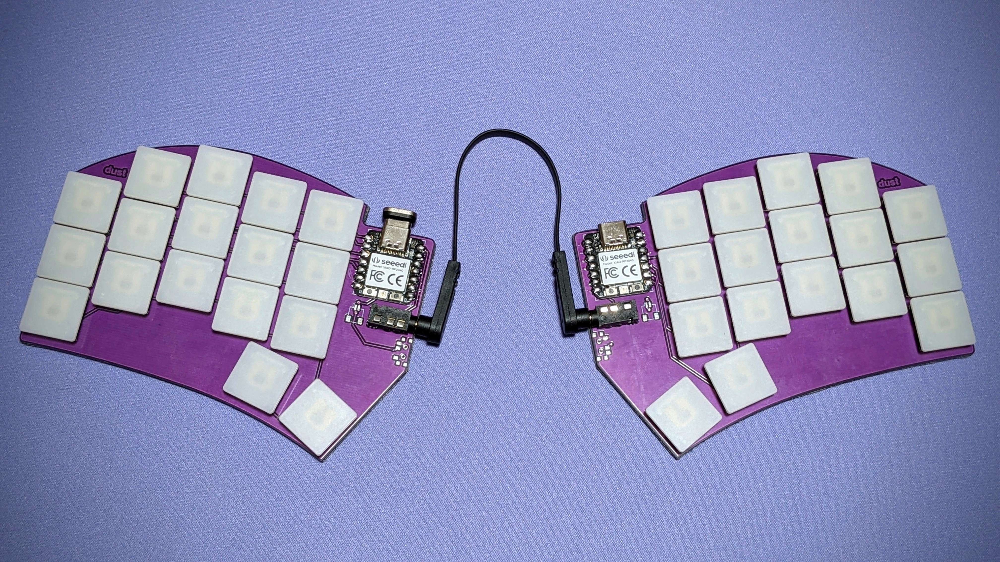
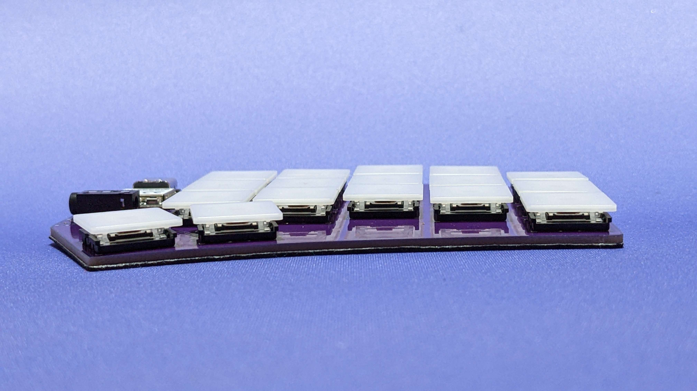

# dust
## ultrathin sweep-alike

| Left | Right |
| :---: | :---: |
|  |  |

**dust** is my attempt at making the thinnest sweep-alike.
### Sacrifices were made.  

- XIAO is surface mounted to be reversible without jumpers.  
- There is no reset button because the xiao has one on it.  
- Soldering the battery connection on the XIAO is gonna suck.
- You're probably gonna need to tape the battery to the board.

## MATERIALS
- 34x [Kailh X Switches](https://www.aliexpress.us/item/2251832799288171.html)
- 34x [1N4148 - SOD-123 Diodes](https://www.aliexpress.us/item/3256801606142520.html)
- 2x SeeedStudio XIAO (RP2040 or BLE)
- 2x [TRRS Jack](https://www.aliexpress.us/item/3256801742337046.html) (RP2040)
- 2x [Power Switch](https://mkultra.click/alps-ssss811101/) (BLE)
- 2x [Battery](https://tinycircuits.com/collections/all/products/lithium-ion-polymer-battery-3-7v-40mah) (BLE)
- 2x [Battery Connector](https://www.aliexpress.us/item/3256803789364982.html) (BLE)

## CASE
3D Printable case designed by ant: [Dust Tray](https://github.com/Ant6009/Dust_Tray)

## FIRMWARE

[QMK](https://github.com/jasonhazel/qmk_hazel/tree/master/keyboards/jasonhazel/dust)

[ZMK](https://github.com/jasonhazel/zmk-config/tree/master/config/boards/shields/dust)
