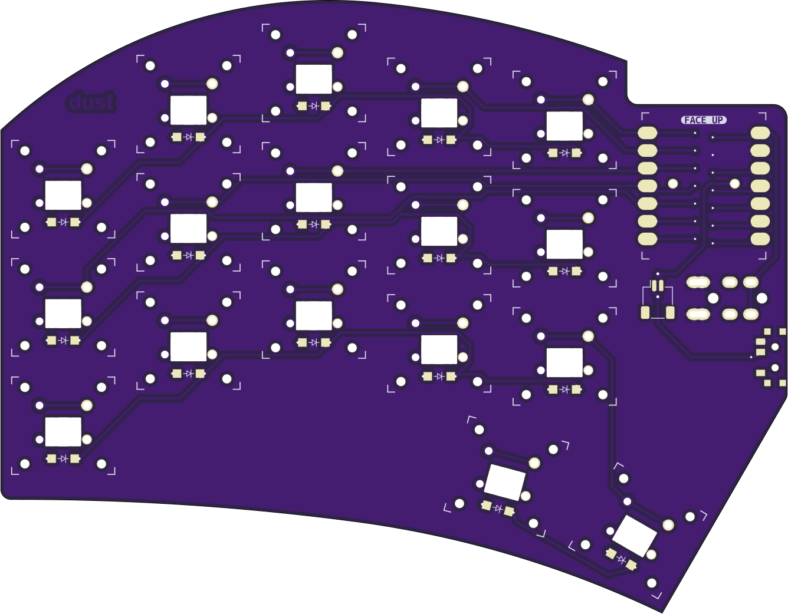
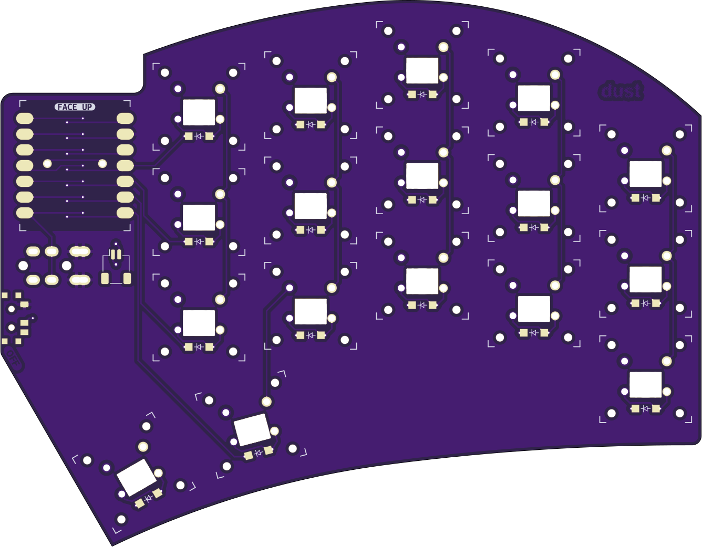

# dust
# UNTESTED PROTOTYPE!

| Left | Right |
| :---: | :---: |
|  |  |

## ultrathin sweep-alike

**dust** is my attempt at making the thinnest sweep-alike while experimenting.  In theory, this could be as low as 7mm total. 🤞

### Sacrifices were made.  

- XIAO is surface mounted to be reversible without jumpers.  
- There is no reset button because the xiao has one on it.  
- Soldering the battery connection on the XIAO is gonna suck.
- You're probably gonna need to tape the battery to the board.
- The XSwitch and XIAO footprints were created by me and _might_ work.  
- There is a good chance this won't work at all in its current state
- I could've done 36 key, but then I wouldn't have enough X Switches to build a 36 key later.

## MATERIALS
- 34x [Kailh X Switches](https://www.aliexpress.us/item/2251832799288171.html)
- 34x [1N4148 - SOD-123 Diodes](https://www.aliexpress.us/item/3256801606142520.html)
- 2x SeeedStudio XIAO (RP2040 or BLE)
- 2x [TRRS Jack](https://www.aliexpress.us/item/3256801742337046.html) (RP2040)
- 2x [Power Switch](https://mkultra.click/alps-ssss811101/) (BLE)
- 2x [Battery](https://tinycircuits.com/collections/all/products/lithium-ion-polymer-battery-3-7v-40mah) (BLE)
- 2x [Battery Connector](https://www.aliexpress.us/item/3256803789364982.html) (BLE)

## FIRMWARE - WIP

[QMK](https://github.com/jasonhazel/qmk_hazel/tree/master/keyboards/jasonhazel/dust)

[ZMK](https://github.com/jasonhazel/zmk-config/tree/master/config/boards/shields/dust)

## SUPPORT

<a property="dct:title" rel="cc:attributionURL" href="https://github.com/jasonhazel/dust">dust</a> by <a rel="cc:attributionURL dct:creator" property="cc:attributionName" href="https://github.com/jasonhazel">Jason Hazel</a> is licensed under <a href="http://creativecommons.org/licenses/by/4.0/?ref=chooser-v1" target="_blank" rel="license noopener noreferrer" style="display:inline-block;">CC BY 4.0</a>

