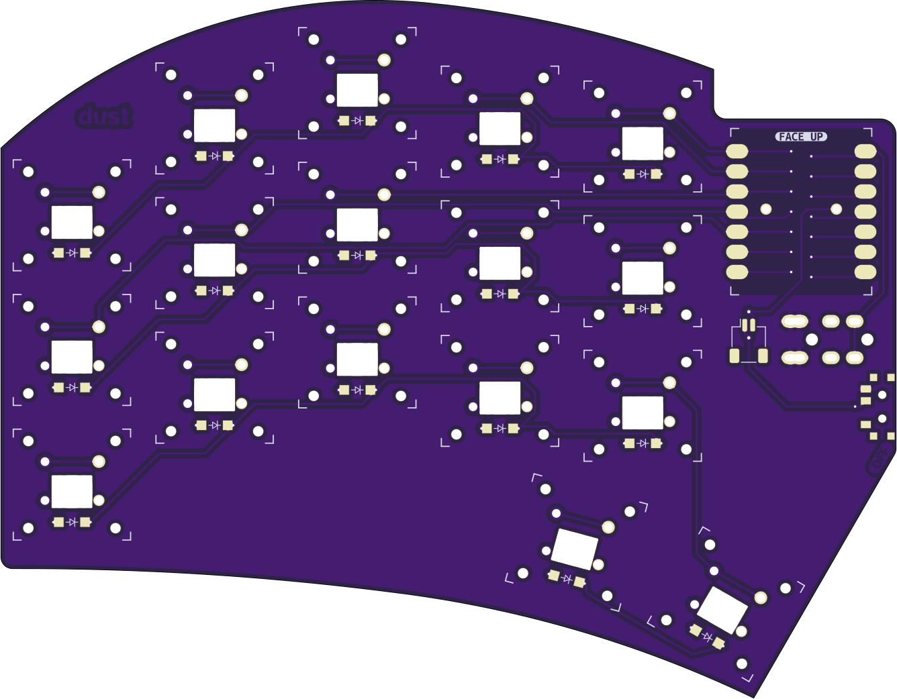

# dust

| Left | Right |
| :---: | :---: |
|  |  |

# UNTESTED PROTOTYPE!

## ultrathin sweep-alike

**dust** is my attempt at making the thinnest sweep-alike while experimenting.  Sacrifices were made.  XIAO is surface mounted to be reversible without jumpers.

## MATERIALS
- 34x [Kailh X Switches](https://mkultra.click/kailh-x-switches-and-keycaps/)
- 34x [1N4148 - SOD-123 Diodes](https://mkultra.click/diode-1n4148-sod-123f/)
- 2x SeeedStudio XIAO (RP2040 or BLE)
- 2x TRRS Jack (RP2040)
- 2x [Power Switch](https://mkultra.click/alps-ssss811101/) (BLE)
- 2x Battery (BLE)
- 2x Battery Connector (BLE) _todo: find good source_

## FIRMWARE
** placeholder links **

[QMK](https://github.com/jasonhazel/qmk_hazel/tree/master/keyboards/jasonhazel/dust)

[ZMK](https://github.com/jasonhazel/zmk-config/tree/master/config/boards/shields/dust)

## SUPPORT

<a property="dct:title" rel="cc:attributionURL" href="https://github.com/jasonhazel/dust">dust</a> by <a rel="cc:attributionURL dct:creator" property="cc:attributionName" href="https://github.com/jasonhazel">Jason Hazel</a> is licensed under <a href="http://creativecommons.org/licenses/by/4.0/?ref=chooser-v1" target="_blank" rel="license noopener noreferrer" style="display:inline-block;">CC BY 4.0</a>

